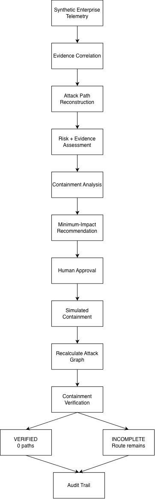

# ChainBreak

Attack-Path-Aware Containment for Security Incidents

ChainBreak reconstructs viable attacker paths through a synthetic enterprise environment and evaluates containment actions for security effectiveness and operational disruption. It identifies the lowest-cost action set that breaks all currently viable paths, requires analyst approval, simulates the response, and independently verifies whether containment succeeded.

**Synthetic enterprise environment · Simulation only**

## The Problem

A SOC may know an incident requires containment while having several possible responses: disable an account, isolate a workstation or server, revoke a credential/token, or disable a service. Aggressive containment can stop an attack while unnecessarily disrupting legitimate operations.

ChainBreak asks:

> What is the smallest safe containment action that breaks the attacker's path to the protected asset while disrupting the least legitimate activity?

In this prototype, operational impact is represented by configured disruption costs, and containment means eliminating graph reachability to the protected asset.

## What ChainBreak Does

Synthetic telemetry → evidence correlation → attack-path reconstruction → risk/evidence assessment → containment candidate analysis → minimum-impact complete containment → human approval → simulated action → attack-graph recalculation → containment verification → audit trail.

The graph engine finds all viable simple paths along directed relationships. The containment engine evaluates individual actions and combinations, selecting the lowest total cost that achieves complete containment. Ties favor fewer actions, then sorted action IDs. If no combination succeeds, it returns no recommendation; if the asset is already unreachable, it returns an empty action set.

Recommendation predicts an outcome. Verification independently recalculates reachability on the post-action graph. These are separate steps.

## Demo Scenario

**Compromised identity:** Alice

**Protected asset:** Customer Database

```text
Alice → Alice-Laptop → Dev-Server
                          ├─ Deployment Token → Deployment Service ─┐
                          └─ Backup Service Token → Backup Service ─┤
                                                                   ↓
                                                           Customer Database
```

The two viable paths are:

1. Alice → Alice-Laptop → Dev-Server → Deployment Token → Deployment Service → Customer Database
2. Alice → Alice-Laptop → Dev-Server → Backup Service Token → Backup Service → Customer Database

The deployment and backup branches provide independent alternatives after the shared Alice, laptop, and Dev-Server prefix. Blocking one branch leaves the other available.

## Containment Decision

The current configured candidates have these simulated outcomes:

| Action | Operational cost | Paths remaining | Containment |
| --- | ---: | ---: | --- |
| Revoke Deployment Token | 1 | 1 | INCOMPLETE |
| Revoke Backup Service Token | 2 | 1 | INCOMPLETE |
| Disable Alice account | 5 | 0 | COMPLETE |
| Isolate Alice-Laptop | 8 | 0 | COMPLETE |
| Disable Deployment Service | 10 | 1 | INCOMPLETE |
| Disable Backup Service | 12 | 1 | INCOMPLETE |
| Isolate Dev-Server | 20 | 0 | COMPLETE |

The computed recommendation is **Revoke Deployment Token + Revoke Backup Service Token**:

- Total operational cost: **3**
- Paths before: **2**
- Predicted paths after: **0**

The containment engine computes this result by comparing candidate subsets; the selected actions are not hardcoded. Cost 3 is 40% lower than disabling Alice, 62.5% lower than isolating Alice-Laptop, and 85% lower than isolating Dev-Server.

Costs are additive, illustrative operational-disruption units for this demonstration, not monetary values or measured business impact.

## Why Verification Matters

Revoking only Deployment Token changes **2 paths → 1 path**. The Backup Service route survives, so ChainBreak reports **CONTAINMENT INCOMPLETE** and displays the remaining path.

Approving and simulating the recommended token pair changes **2 paths → 0 paths**, producing **CONTAINMENT VERIFIED**.

Verification searches the resulting graph again. It does not trust the recommendation's predicted result. The dashboard distinguishes predicted remaining paths from verified post-action state and retains contained nodes as visual references.

## Evidence and Risk

Nine synthetic events describe an unusual successful login, suspicious PowerShell execution, an SSH session, two credential-file reads, two token authentications, and two database access attempts. An access attempt does not establish successful data access or exfiltration.

Events correlate by actor and target entity IDs within the incident scope. A transition receives support only when its directed endpoints and expected relationship type match the graph. PowerShell provides entity context rather than independently proving a transition. Event IDs are deduplicated.

Per-path evidence coverage is supported transitions divided by total transitions. Overall coverage counts unique transitions once, avoiding double-counting shared prefixes. Confidence is overall coverage multiplied by 100, rounded to one decimal: high at 80 or above, medium at 50 or above, otherwise low. **Confidence measures evidence completeness, not attack probability.** It is not ML-based or calibrated against sensor reliability.

The deterministic risk score sums the following contributions, capped at 100:

| Factor | Points |
| --- | --- |
| Reachable protected asset criticality | Critical: 30; high: 20; medium: 10; low/unspecified: 0 |
| Protected asset reachable | 25 |
| At least two viable paths | 10 |
| Supported credential-file access on a path | 15 |
| Overall evidence coverage | round(20 × coverage) |

Severity and priority follow the score: 80–100 is critical/P1, 60–79 high/P2, 30–59 medium/P3, and below 30 low/P4. The CLI and dashboard expose the contributing factors. Risk does not grant approval or change containment optimization.

A small rule set attaches MITRE ATT&CK context to matching evidence: T1078 (Valid Accounts), T1059.001 (PowerShell), T1552.001 (Credentials In Files), and T1021.004 (SSH). Each mapping identifies its supporting event. These labels provide context, not proof of malicious intent.

## Human-in-the-Loop Safety

Recommendations do not execute automatically. The controlled workflow requires explicit approval bound to the recommendation and its action IDs. Demo approvals use the generic analyst identity `SOC-Analyst`; this is a simulated identity, not authentication.

Actions remove targets and associated relationships from a copy of the graph. The original graph is preserved, and the protected asset cannot be proposed as a containment target. There are no external response APIs, and no real accounts, tokens, hosts, or services are modified.

The append-only in-memory audit records analysis, recommendation, approval or denial, blocked execution, simulated actions, and verification. Events include UTC timestamps, relevant IDs, status, and details. Audit data lasts for the workflow's lifetime; it is not a persistent audit service.

## Evaluation

**Verified result: 7/7 scenarios PASS.**

| Scenario | Observed result |
| --- | --- |
| Normal activity | 0 viable paths; no disruptive recommendation or response |
| Active compromise | 2 → 0 paths after approval; cost 3; VERIFIED |
| Suspicious but non-reachable | Suspicious evidence retained; 0 viable paths; no disruptive containment recommended |
| Missing telemetry | 50% overall evidence coverage; confidence 50/100; analysis continues and reports incomplete evidence |
| Partial containment | 2 → 1 paths; Backup Service route survives; INCOMPLETE |
| Recommended containment | 2 → 0 paths; VERIFIED; original graph and protected asset preserved |
| High-impact alternatives | Account, laptop, and server actions also contain the attack, at costs 5, 8, and 20 |

The missing-telemetry case omits credential-file and token-authentication observations. Each path retains 3/5 supported transitions; overall coverage is 4/8 unique transitions. Both routes remain reconstructable from the graph, and no response occurs without approval.

The evaluation writes actual observations, expectations, checks, and pass/fail results to `evaluation_results.json`. Generated IDs and timestamps are excluded to keep results deterministic. Failed scenarios produce a nonzero CLI exit code.

These are synthetic regression/evaluation scenarios, not a real-world detection-accuracy benchmark.

## Testing

**58 automated tests passing.** The verification runner reports **OVERALL: PASS**.

Tests cover graph traversal, cycles and duplicate relationships, containment optimization and deterministic tie breaking, graph immutability, protected-asset safety, evidence correlation, missing telemetry, risk/confidence behavior, approval enforcement, incomplete containment, independent verification, audit behavior, and evaluation determinism.

```sh
python3 scripts/verify.py
python3 -m unittest discover -s tests -v
```

The runner checks actual program state and reports failures with a nonzero exit code. Its Python audit hook blocks standard-library network/process-launch attempts during verification. This is a regression guard for exercised code, not an OS sandbox.

## Architecture



*Architecture image placeholder; the image has not yet been created.*

Telemetry → Evidence → Attack Graph → Risk → Containment Optimization → Human Approval → Simulation → Verification → Audit.

The Streamlit dashboard and CLI reuse the same backend modules. The workflow connects analysis and recommendation to explicit approval, copied-graph simulation, independent verification, and audit events.

## Project Structure

```text
ChainBreak/
├── app.py                       # Single-page Streamlit dashboard
├── requirements.txt             # Pinned UI dependencies
├── README.md
├── LICENSE
├── evaluation_results.json      # Generated evaluation artifact
├── .streamlit/
│   └── config.toml              # Theme and disabled usage statistics
├── data/
│   ├── environment.json         # Synthetic entities and relationships
│   ├── events.json              # Synthetic security observations
│   └── evaluation/
│       └── scenarios.json       # Seven scenario definitions
├── scripts/
│   └── verify.py                # Automated test and behavior verification
├── src/
│   ├── __init__.py
│   ├── models.py                # Entity and relationship dataclasses
│   ├── graph.py                 # Environment loading and simple-path discovery
│   ├── incident.py              # Evidence, risk, confidence, ATT&CK context
│   ├── containment.py           # Action simulation and cost optimization
│   ├── workflow.py              # Approval, execution, verification, audit
│   └── evaluation.py            # Scenario execution and JSON reporting
└── tests/
    ├── test_graph.py
    ├── test_incident.py
    ├── test_containment.py
    ├── test_workflow.py
    └── test_evaluation.py
```

The architecture image path above is planned and is not part of the current file tree.

## Running ChainBreak

Use Python 3.9 or later. Run these commands from the repository root.

Install the UI dependencies:

```sh
python3 -m pip install -r requirements.txt
```

Launch the dashboard:

```sh
python3 -m streamlit run app.py
```

Select **Approve Recommended Containment** to approve and simulate the computed recommendation. **Test Partial Containment** explicitly approves only Deployment Token revocation. Results persist across reruns; **Reset Demo** restores the original analysis state.

Run the backend CLI demonstrations:

```sh
python3 -m src.graph
python3 -m src.incident
python3 -m src.incident --missing-telemetry
python3 -m src.containment
python3 -m src.workflow
python3 -m src.workflow --approve SOC-Analyst
python3 -m src.workflow --incomplete --approve SOC-Analyst
python3 -m src.workflow --deny SOC-Analyst
```

Without an approval argument, the workflow applies no actions. The incident and workflow CLIs also accept `--events PATH`; a missing file is handled as absent telemetry.

Run evaluation, verification, and tests:

```sh
python3 -m src.evaluation
python3 scripts/verify.py
python3 -m unittest discover -s tests -v
```

Evaluation regenerates `evaluation_results.json` in the repository root.

## Dependencies and Data

Direct dependencies in `requirements.txt`:

- `streamlit==1.49.1`: dashboard and session-state interface.
- `graphviz==0.21`: graph descriptions for the dashboard visualization.

The backend CLI, evaluation, and unittest suite use the Python standard library. UI dependency installation also resolves those packages' transitive dependencies.

The enterprise environment, security events, and evaluation scenarios are synthetic and created for this project. They use no private or unauthorized data. There are no live telemetry feeds or connected external datasets.

## Limitations

- The environment and telemetry are synthetic, not production observations.
- Disruption costs are configured illustrative values and add together without modeling business dependencies.
- Containment actions are simulated; entity removal does not model previously stolen credentials or persistence outside the graph.
- Graph relationships are supplied by the synthetic environment, not discovered from infrastructure.
- Evidence inputs are scoped to the incident; correlation does not establish causality across unrelated feeds.
- Exhaustive simple-path and candidate-subset enumeration is intended for this small environment, not validated for enterprise-scale graphs.
- Evaluation is not a production detection benchmark.
- There are no external identity, EDR, or cloud enforcement integrations.

## Security / Responsible Use

ChainBreak is a defensive, simulation-only project. It does not perform real destructive or disruptive actions. Its recommendations demonstrate graph-based containment reasoning and are not an authorization to act on real infrastructure.

## Hackathon Disclosure

ChainBreak was developed for **AI Defense Lab 2026**.

The declared open-source/runtime dependencies are Streamlit 1.49.1 and the Graphviz Python package 0.21, as listed in `requirements.txt`. Synthetic data was created for the project.

## License

ChainBreak is distributed under the MIT License. See [LICENSE](LICENSE).
